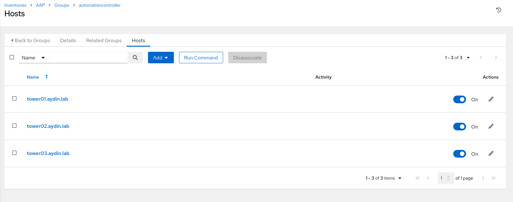
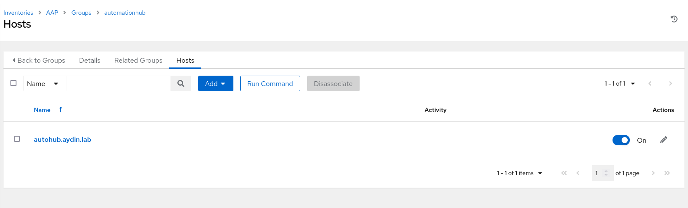

# Ansible Automation Platform Backup

Playbook to create Red Hat Ansible Tower backup from Ansible Tower;

- Create an inventory at Ansible Tower which has the same structure as the one that is used at the installation.






- Set the inventory variables similiar as below (same as the inventory variables used to create the AAP cluster);

```
---
backup_host: tower01.aydin.lab
backup_dest: '/data/tower/backup/'
admin_password: 'redhat'
pg_host: 'pghost.aydin.lab'
pg_port: '5432'
pg_database: 'awx'
pg_username: 'awx'
pg_password: 'redhat'
pg_sslmode: 'prefer'  
registry_url: 'registry.redhat.io'
registry_username: 'redhataccount'
registry_password: 'redhatpass'
receptor_listener_port: 27199
automationhub_admin_password: 'redhat'
automationhub_pg_host: 'pghost.aydin.lab'
automationhub_pg_port: '5432'
automationhub_pg_database: 'automationhub'
automationhub_pg_username: 'automationhub'
automationhub_pg_password: 'password'
automationhub_pg_sslmode: 'prefer'
```

- Tested with Red Hat Ansible Automation Platform 2.1


- Some changes from the default backup role;

  - Used sync module instead of fetch at download.yml

  - Changed the "delegate_to" from localhost to {{ backup_host }} variable 

  - Added collections requirements.yml for community.general